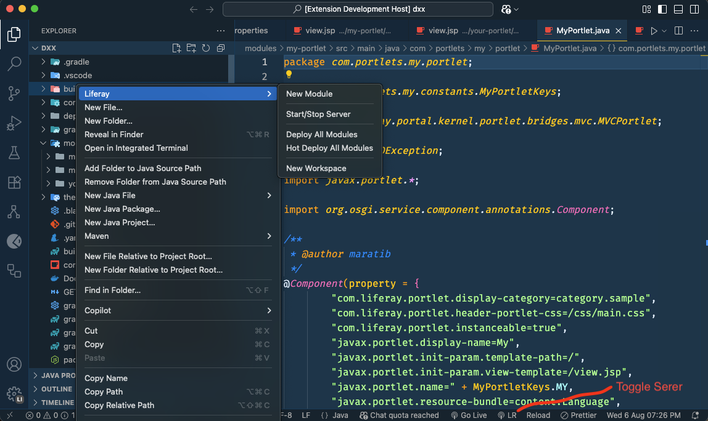

# Liferay Studio

<p align="center">
  <strong>The power of a Liferay IDE, inside the editor you love.</strong>
</p>

---

**Liferay Studio** is a meticulously crafted extension that brings a seamless, integrated, and blazing-fast Liferay development experience directly into Visual Studio Code. Say goodbye to context switching and hello to a unified, modern workflow.



## ✨ Key Features

- 🚀 **Zero to Liferay in Seconds**: Scaffold complete Liferay Workspaces and Modules directly from the Command Palette.

- 📡 **Integrated Server Control**: Start and stop your Liferay instance without ever leaving VS Code, with a handy status bar toggle.

- 🪄 **One-Command Deployment**: Build, deploy, and even hot-deploy all modules with a single command. The hot-deploy watcher automatically redeploys on save, giving you a rapid feedback loop.

- 🗃️ **Context-Aware Menus**: Access all commands through a convenient "Liferay" context menu in the file explorer.

- 📦 **Curated Environment**: Automatically installs recommended extensions for Java, JSP, and Freemarker to give you a first-class development experience out of the box.

- 🧠 **Smart & Efficient**: The extension only activates when a Liferay workspace is detected, keeping your editor lean and fast.

## 🏁 Getting Started

### 1. Prerequisites

Before you begin, ensure you have the following installed:

- Java JDK 21 or higher
- Liferay's Blade CLI

### 2. Installation

Install **Liferay Studio** from the VS Code Marketplace.

### 3. Initial Workspace Setup

After creating your first Liferay Workspace using the extension, you need to tell it where your Liferay server bundle is located.

1.  Open the `gradle.properties` file in the root of your new workspace.
2.  Add the following line, pointing to your Liferay Portal home directory:

```properties
# This should point to the root of your Liferay bundle (e.g., /path/to/liferay-ce-portal-7.4.3.113-ga113)
liferay.workspace.home.dir=/path/to/your/liferay/bundle
```

### Start/Stop liferay server

- `cmd/ctrl+shift+p` : Liferay Studio: Start/Stop Liferay Server

- Alternatively you have a vscode bottom status bar item with an `antenna` icon labeled as `LR` to toggle liferay server start/stop

### Create new liferay module

- `cmd/ctrl+shift+p` : Liferay Studio: Create Liferay Module

### Deploy all modules

- `cmd/ctrl+shift+p` : Liferay Studio: Deploy All Modules
- This command will deploy all modules for once

### Hot deploy all modules

- `cmd/ctrl+shift+p` : Liferay Studio: Hot Deploy All Modules
- This command will deploy all modules and keep watching for the changes to auto redeploy on change detection.

## Features

- Create new Liferay workspace from within VSCode
- Start Liferay Server from within VSCode with just one click.
- Deploy all modules with single command, it will deploy once.
- Hot deploy all modules with single, it will watch for the changes and redeploy if changed.

## Extension Settings

| setting        | description                | default | example/notes                                          |
| -------------- | -------------------------- | ------- | ------------------------------------------------------ |
| **Process**    |
| `hot-deploy`   | Liferay modules hot deploy | false   | `"liferayStudio.hot-deploy": true`                     |
| `liferay-home` | Liferay modules hot deploy | ""      | `"liferayStudio.liferay-home": /User/xyz/Liferay/Home` |

## Known Issues
